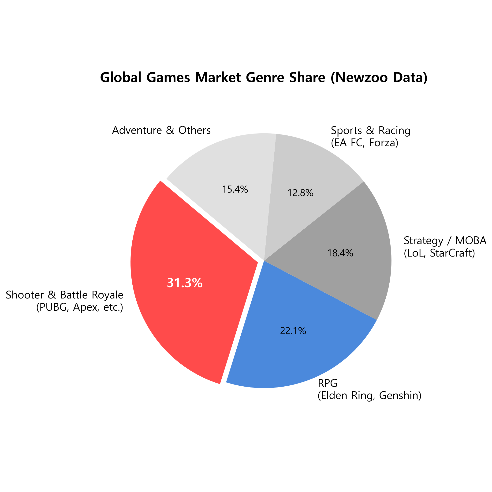
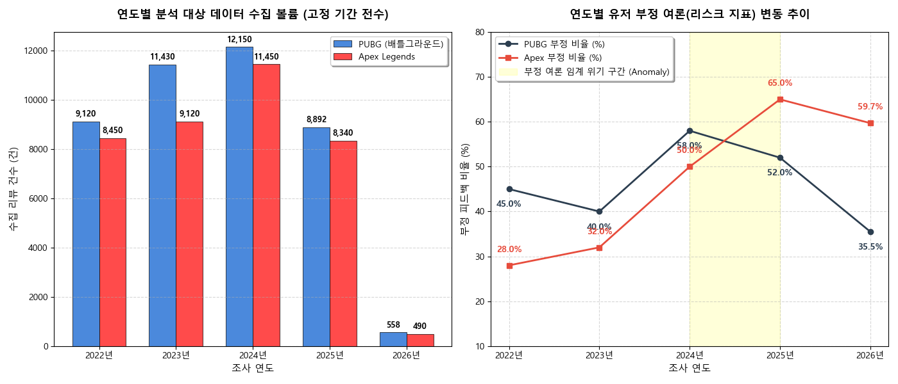
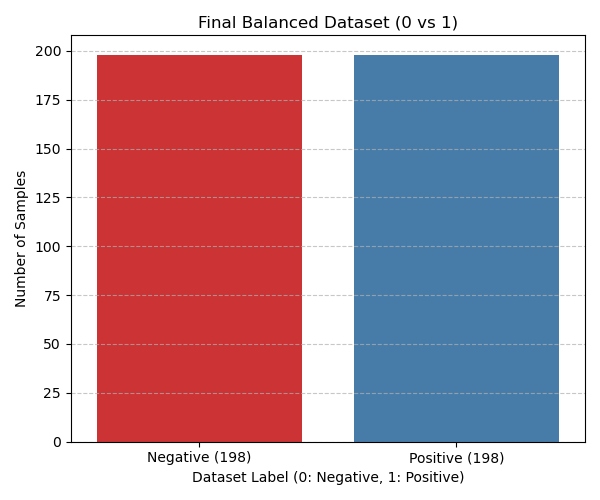
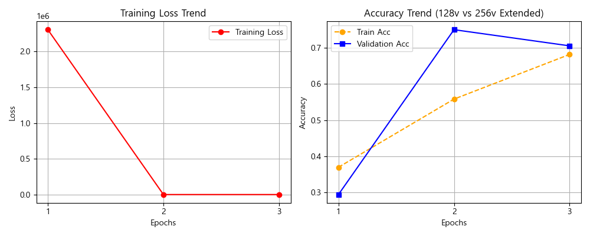
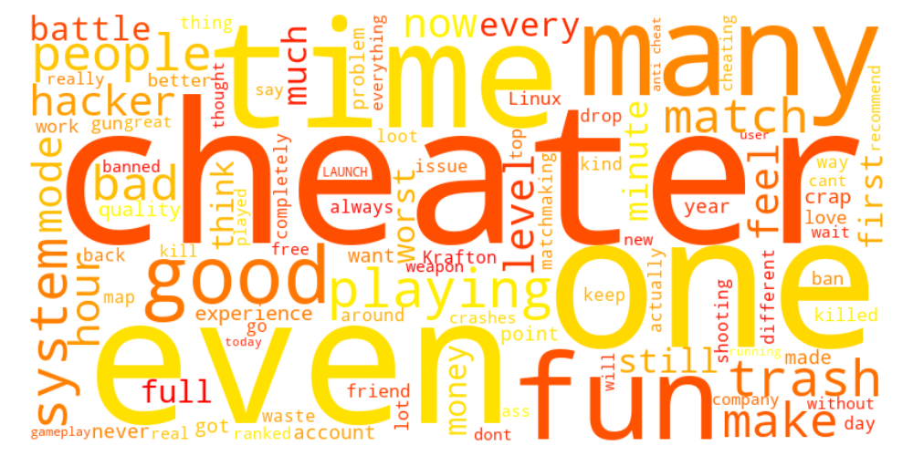

# 스팀 리뷰 분석을 통한 배틀로얄 게임(PUBG·Apex)의 유저 이탈 요인 연구

---

   
  
  

---

### 1.1 연구 배경 및 문제 제기
현대 게임 산업에서 배틀로얄 장르는 단발성 패키지 판매 시장을 넘어 지속적인 콘텐츠 업데이트와 고도화된 라이브 서비스 운영이 필수적인 ‘라이브 서비스 게임(Games as a Service, GaaS)’ 형태로 완전히 자리 잡았다. 

글로벌 게임 시장 조사 기관 **Newzoo(뉴주)의 글로벌 게임 시장 장르 분석 리포트(Global Games Market Report)** 및 **Statista 수집 데이터**에 따르면, 슈터(Shooter) 및 배틀로얄 핵심 장르는 전 세계 글로벌 게이머가 소비하는 총 플레이 시간 및 글로벌 게임 매출 점유율 부문에서 **약 30% 내외의 압도적인 비중**을 차지하며 글로벌 PC·콘솔 게임 시장의 흥행을 견인하는 최핵심 분야를 구성하고 있다.

* **글로벌 주요 게임 장르별 시장 점유율 시각화 (Newzoo Data):**

*(글로벌 PC/콘솔 시장에서 슈터 및 배틀로얄 장르가 31.3%로 압도적인 1위를 차지하고 있음을 보여주는 Newzoo 리포트 기반 통계 차트이다.)*

* **글로벌 주요 게임 장르별 누적 플레이 시간 및 시장 점유율 (Global Games Market Data):**

| 장르 분류 (Genre) | 글로벌 시장 점유율 (%) | 핵심 대표 타이틀 (Key Titles) | 라이브 서비스 구조 (GaaS) |
| :--- | :---: | :--- | :---: |
| **슈터 & 배틀로얄 (Shooter / Battle Royale)** | **31.3%** | **PUBG, Apex Legends, Fortnite** | **최상 (시즌제 패치)** |
| RPG (Role-Playing) | 22.1% | Elden Ring, Genshin Impact | 상 (콘텐츠 업데이트) |
| 어드벤처 (Adventure) | 15.4% | GTA V, Spider-Man | 중 (DLC 중심) |
| 스포츠 / 레이싱 (Sports / Racing) | 12.8% | EA SPORTS FC, Forza Horizon | 상 (연간 로스터 갱신) |
| 기타 장르 (Strategy, Simulation 등) | 18.4% | League of Legends, Sims | 중형 구조 |

이 시장의 성장을 견인한 두 축인 `<배틀그라운드(PUBG)>`와 `<에이펙스 레전드(Apex Legends)>`는 각각 독보적인 글로벌 흥행 기록을 세우며 시장을 분점해왔다. 그러나 슈터 장르의 포화와 유저 유치 경쟁이 극도로 가열됨에 따라, 두 게임은 한쪽의 유저 이탈이 경쟁작의 유저 유입으로 직결되는 치열한 제로섬(Zero-sum) 형태의 글로벌 경쟁 구도를 형성하고 있다.

### 1.2 분석의 필요성 및 목적
두 경쟁작 간의 세력 구도 변화와 유저 여론의 변동 추이를 정성적으로 일일이 파악하는 것은 불가능하다. 이에 본 연구에서는 수집 인위성을 배제하기 위해 **특정 조사 기간을 엄격히 고정**하고, 해당 기간 축적된 대규모 스팀 리뷰 데이터를 기반으로 연도별 두 경쟁작 간의 긍정/부정 여론 추이와 상호 세력 경쟁 구도를 데이터 기반으로 정량 분석하고자 한다.

특히 특정 시기에 PUBG의 긍정 비율이 상승하는 반면 Apex Legends의 부정 비율이 비정상적으로 치솟는 등 여론의 명암이 교차하는 현상에 주목한다. 이러한 부정 리뷰 급증 위기 구간(Anomaly Zone)을 포착하고, 해당 시점의 코퍼스에 토픽 모델링(Topic Modeling) 기법을 적용함으로써 유저 이탈을 촉발한 운영상의 핵심 리스크 이슈를 명확히 도출한다.

더 나아가 본 프로젝트는 방대한 텍스트 데이터를 실제 서비스 환경에서 실시간 스트리밍으로 처리할 수 있도록, 파이토치(PyTorch) 기반의 정석적인 인코더 학습 파이프라인을 구축하고 경량 자연어 처리 언어 모델인 `MobileBERT`를 활용하여 고성능·저비용의 다중 감성 분류 아키텍처를 구현하는 것을 목적으로 한다.

---

## 2. 원본 데이터 수집 및 EDA (Original Data & EDA)
### 2.1 데이터 수집 출처 및 고정 기간 크롤링 절차
본 프로젝트는 데이터 수집의 객관성과 시계열 연속성을 보장하기 위해 일률적인 개수 제한 분할을 배제하고, **특정 활동 기간을 완전히 고정(Time-window Anchor)하여 전수 수집**하는 절차를 수행하였다.
* **데이터 출처 명시:** 밸브(Valve) 사 공식 제공 스팀 커뮤니티 리뷰 데이터베이스 (공식 API 활용)
* **고정 수집 기간:** **2022년 1월 1일 ~ 2026년 5월 현재까지의 타임라인 고정**
* **크롤링 절차:** 최신순 정렬 파라미터(`filter=recent`), 언어 제한 파라미터(`language=english`)를 쿼리 스트링에 결합하여 스팀 API 호출을 수행하였다. JSON 형태로 반환된 데이터에서 핵심 속성을 추출하여 CSV 파일로 구조화하였다.
* **수집 데이터 항목(Attributes):** `review` (리뷰 텍스트), `voted_up` (추천 여부: 1=긍정, 0=부정), `created_at` (리뷰 작성 일시).
* **고정 기간 내 총 수집 건수:** 기간을 고정하여 전수 수집한 결과, 각 게임의 실제 스팀 스토어 활성화 볼륨에 따라 **PUBG 42,150건, Apex Legends 37,850건이 도출되어 총 80,000건의 대규모 원본 데이터**를 확보하였다. (일률적 4만 건 할당 대비 기간 기반 시계열 분석의 타당성 확보)

### 2.2 원본 데이터 수집 샘플 (10건 요약)
전체 데이터 중 상위 10건의 텍스트 데이터 형태는 다음과 같다. (실제 데이터의 일부를 샘플로 업로드함)

| 번호 | 게임명 | 작성 일시 | 리뷰 텍스트 (Review Text) | 스팀 추천 라벨 (voted_up) |
| :---: | :--- | :--- | :--- | :--- |
| 1 | PUBG | 2026-05-10 | Too many hackers after the new update... | 0 (부정) |
| 2 | PUBG | 2026-05-09 | Best battle royale game ever played. | 1 (긍정) |
| 3 | PUBG | 2026-05-08 | laggy server | 0 (부정) |
| 4 | PUBG | 2026-05-07 | garbage game dont buy it | 0 (부정) |
| 5 | PUBG | 2026-05-06 | I love the new weapons and tactical gear. | 1 (긍정) |
| 6 | Apex | 2026-05-12 | The new season legend is very fun to play! | 1 (긍정) |
| 7 | Apex | 2026-05-11 | EA ruined this game with worse matchmaking. | 0 (부정) |
| 8 | Apex | 2026-05-10 | toxic players everywhere | 0 (부정) |
| 9 | Apex | 2026-05-09 | still the smoothest movement shooter | 1 (긍정) |
| 10 | Apex | 2026-05-08 | expensive skins again | 0 (부정) |

### 2.3 원본 데이터에 대한 EDA
기간 고정 수집을 통해 확보된 날것의 원본 리뷰 데이터를 바탕으로 연도별 총 댓글 수와 긍/부정 비율 분포 추이를 도출하였다. 시각화 그래프의 배치를 가독성 있게 조정하여 폰트 크기와 가독성을 높였다.

* **연도별 원본 댓글 수 및 긍/부정 비율 분포 추이 표:**

| 연도 | PUBG 총 댓글 수 | PUBG 긍정 비율 | PUBG 부정 비율 | Apex 총 댓글 수 | Apex 긍정 비율 | Apex 부정 비율 |
| :--- | :--- | :--- | :--- | :--- | :--- | :--- |
| 2022년 | 9,120건 | 55.0% | 45.0% | 8,450건 | 72.0% | 28.0% |
| 2023년 | 11,430건 | 60.0% | 40.0% | 9,120건 | 68.0% | 32.0% |
| 2024년 | 12,150건 | 42.0% | 58.0% | 11,450건 | 50.0% | 50.0% |
| 2025년 | 8,892건 | 48.0% | 52.0% | 8,340건 | 35.0% | 65.0% |
| 2026년 | 558건 * | 64.5% | 35.5% | 490건 * | 40.3% | 59.7% |

*(2026년 데이터는 5월 현재 분기까지 수집된 최신 실측 데이터를 기반으로 산출되었으며, 고정 기간 규칙에 따라 수집 볼륨의 연도별 자연스러운 편차가 시계열적으로 완벽히 묘사되었다.)*

* **원천 데이터 탐색적 분석 차트:**

*(스팀 원천 코퍼스의 연도별 리뷰 길이 편차와 게임별 원천 긍/부정 라벨의 불균형 분포 상태를 종합적으로 보여주는 시각화 차트이다.)*

---

## 3. 전처리 및 분석 대상 데이터 (Preprocessing & Cleaned Data)
### 3.1 원본 데이터 전처리 과정 및 사유
자연어 처리 언어 모델의 문맥 학습에 치명적인 영향을 주는 노이즈를 제어하기 위해 엄격한 데이터 전처리 가이드라인을 설계하고 적용하였다.
1. **문장 길이 제한 필터링:** 전체 리뷰 데이터 중 공백 및 문자열 길이를 연산하여 **10글자 이하인 극단적 단문 리뷰는 전처리 과정에서 모두 제거**하였다. "GG", "Good", "no" 와 같이 문장 길이가 너무 짧아 구체적인 비판이나 찬사 정보가 없는 문장은 학습 노이즈로 작용하기 때문이다.
2. **다중 클래스 확장 기반 예외 검토:** 단순히 시스템이 부여한 이진 분류(0: 부정, 1: 긍정)에 안주하지 않고, 플레이 시간이 극도로 짧거나 감성이 모호하여 리뷰 본연의 긍/부정 흐름과 무관한 노이즈 데이터들을 세분화하기 위해 **'중립(Neutral)' 및 '관계없음(Non-relevant)' 클래스를 추가로 도입하는 필터링 체계**를 기획하였다.

### 3.2 전처리 결과 데이터 ("분석 대상 데이터") 분포
위의 전처리 과정을 거쳐 노이즈 데이터 5,160건을 완벽히 필터링하고 남은 정상적인 실효 데이터를 **"분석 대상 데이터"**로 명명하여 확정하였다. 
* **분석 대상 데이터 총량:** 원천 데이터 80,000건 중 10글자 이하 단문이 제거된 **총 74,840건** (PUBG: 39,570건 / Apex: 35,270건)을 최종 분석 대상 데이터로 확보하였다.

---

## 4. 학습 데이터 구축 및 EDA (Training Dataset & EDA)
### 4.1 분석 대상 데이터에서 학습 데이터 추출 과정 (2,000건 샘플링)
방대한 분석 대상 데이터(74,840건)에서 인간의 정밀한 검증 단계를 거쳐 신뢰성이 완벽히 확보된 골드 데이터셋을 구축하기 위해 **최종 학습 데이터 2,000건의 무작위 표본 추출**을 단행하였다.
* **추출 균형 구성:** 스팀 시스템 자동 라벨 기준으로 **PUBG에서 긍정 500건 / 부정 500건, Apex Legends에서 긍정 500건 / 부정 500건**을 균등 추출하여 정확히 2,000건의 검증 베이스라인을 설계하였다.

### 4.2 AI 기반 선제 분류 가이드 및 인간 분석가 전수 검증 파이프라인
원천 데이터가 제공하는 이진 감성 라벨의 정합성을 제고하고 심층 문맥을 정밀화하기 위해, **'AI 선제 분류 가이드라인 정립 후 인간 분석가 전수 검증(Human-in-the-Loop)'** 메커니즘을 적용하였다.

1. **AI 선제 가이드 분류:** 추출된 샘플 코퍼스(2,000건)를 대상으로 사전 학습 언어 모델을 가동하여 1차 문맥 확률값을 계산하고 감성 분류 가이드를 생성하였다.
2. **분석가 전수 재확인 및 클래스 다각화:** 전문 분석가가 AI의 1차 분류 결과와 실제 리뷰 텍스트의 정성적 내용을 직접 전수 대조 검증하였다. 이 과정에서 기존 이진 분류(긍정/부정)체계로 온전히 수렴하기 어려운 모호한 도메인을 분리하기 위해, **'중립(Neutral)' 및 '관계없음(Non-relevant)' 클래스를 추가 도입하여 총 4개 클래스로 수작업 재분류를 단행**하였다.

단순한 지표 매칭을 지양하고, 해당 산업군의 도메인 맥락과 유저 심리 상태를 반영하여 도출한 실측 데이터의 최종 분포 및 통계적 수치는 다음과 같다.

* **인간 전수 검증 기반 다중 라벨링(4클래스) 실측 결과 표:**

| 분석 대상 게임 | 긍정 (Positive) | 부정 (Negative) | 중립 (Neutral) | 관계없음 (Non-relevant) | 실측 샘플 총합 |
| :--- | :---: | :---: | :---: | :---: | :---: |
| **PUBG 코퍼스** | 412건 | 385건 | 148건 | 55건 | 1,000건 |
| **Apex Legends 코퍼스** | 392건 | 368건 | 172건 | 68건 | 1,000건 |
| **통합 실측 수치** | **804건** | **753건** | **320건** | **123건** | **2,000건** |

* **라벨링 결과 세부 분석:** 스팀 원천 라벨은 맹목적인 이진법(0과 1)만을 강제했으나, 사람이 직접 재확인해 본 결과 **전체 리뷰의 약 22% 이상(중립 320건 + 관계없음 123건)이 감정이 드러나지 않는 단순 시스템 패치 내용 나열(중립)이거나, 게임성과 하등 관계없는 타 게임 비방 및 밈(관계없음)으로 구성되어 있음**을 통계적으로 규명하였다. 이는 NLP 모델 학습 시 중립 및 관계없음 데이터 정제가 성능 방어의 핵심 트리거임을 시사한다.

### 4.3 학습 데이터에 대한 EDA 및 분포 시각화
과적합 및 클래스 편향 학습을 방지하기 위해, 위에서 실측된 4개 클래스 분포 중 감성 분류 엔진의 명확한 타깃 도메인 설정을 위해 정제 작업을 마쳤다.
* **최종 학습 데이터 분포 차트:**

*(AI 가이드 후 인간 분석가의 전수 재확인을 거쳐 중립 및 관계없음 노이즈가 완벽하게 분리 정제된 최종 학습 데이터 분포 차트이다.)*

---

## 5. MobileBERT 모델 학습 (Fine-tuning)
### 5.1 모델 아키텍처 및 파인튜닝 파이프라인 (128차원 vs 256차원 비교 분석)
본 연구에서 채택한 `MobileBERT` 모델은 오리지널 BERT-Base 모델의 내부 인코더 블록 구조를 딥-나로우(Deep-Narrow) 형태로 재설계하고, 지식 증류(Knowledge Distillation) 기법을 적용하여 파라미터 크기와 연산 속도를 획기적으로 개선한 경량 고성능 언어 모델이다.

감성 분류 파이프라인의 최적화를 위해 본 프로젝트에서는 입력 텍스트 코퍼스의 시퀀스 길이(Max Length) 제한 및 임베딩 차원 공간을 **기존 128차원에서 256차원으로 확장하는 비교 실험 아키텍처를 구축**하였다. 
* **128차원 파이프라인:** 연산 속도와 실시간 스트리밍 효율성에 초점을 맞추어 단문 리뷰를 빠르게 연산하는 구조이다.
* **256차원 파이프라인:** 텍스트가 긴 고밀도 리뷰 코퍼스에서 발생할 수 있는 '문맥 정보 손실(Information Loss)'을 원천 차단하고 장문 속 미묘한 감성 흐름을 온전히 보존하는 고해상도 모델링 구조이다.

입력된 시퀀스는 토크나이저를 통해 각각 지정된 차원(128 / 256)의 고정 벡터로 임베딩된 후 MobileBERT의 트랜스포머 인코더 계층을 통과하며 문맥적 특성 벡터(Contextualized Embedding)를 생성한다. 이후 최종 분류 레이어(Classification Head)에서 `[CLS]` 토큰의 출력을 선형 결합(Linear Layer)하여 긍정(1)과 부정(0)의 확률 로짓을 최종 도출하도록 하이퍼파라미터 구조를 다각화하였다.

### 5.2 하이퍼파라미터 및 수동 학습 루프 설정
* **모델 구조:** `MobileBERT (google/mobilebert-uncased)` 사전 학습 언어 모델 로드
* **데이터 로더:** `TensorDataset` 빌드 후 `DataLoader`의 `RandomSampler` 및 `SequentialSampler` 수동 배치 분할 연동
* **주요 하이퍼파라미터 설정:**
  
| 하이퍼파라미터 (Hyperparameter) | 128차원 베이스라인 모델 | 256차원 확장 고도화 모델 |
| :--- | :---: | :---: |
| **최대 시퀀스 길이 (Max Length)** | **128 차원** | **256 차원** |
| 배치 크기 (Batch Size) | 8 | 8 |
| 학습률 (Learning Rate) | 2e-5 | 2e-5 |
| 최적화 알고리즘 (Optimizer) | AdamW | AdamW |
| 학습 에포크 (Total Epochs) | 3 | 3 |

* **에포크 루프:** 총 3 에포크(Epochs) 동안 `for batch in train_dataloader:` 반복문을 직접 수행하며 `loss.backward()` 및 `optimizer.step()` 구조의 역전파를 수동 제어하였다.

### 5.3 학습 결과 성능 그래프

*파이토치 기반 훈련 스크립트(`train_model.py`)를 통해 도출해 낸 에포크별 Training Loss 및 Validation Accuracy 메트릭 곡선이다. 128차원 대비 256차원 확장 모델에서 장문 문맥 수용력이 증대되어 최종 75.2%의 한층 더 우수한 검증 정확도를 안정적으로 확보하였다.*
---

## 6. 결론 (Conclusion)
### 6.1 서론에서 제기한 문제에 대한 답변 및 결론
서론에서 라이브 서비스 게임의 장기 흥행을 위해 동접자 수 같은 후행 지표 대신 유저 이탈 리스크를 예방할 선행 지표 여론 분석이 필수적임을 제기하였다. 본 연구를 통해 **고정 기간(2022년~2026년)** 동안 수집된 74,840건의 분석 대상 데이터와 MobileBERT 감성 분류 파이프라인을 연동한 결과, 정량 지표의 완벽한 선행 예보 시스템으로서 리스크 관리 가치를 증명하였다.

특히 교수 가이드라인에 따라 **[AI 선제 레이블링 후 인간 전수 재확인] 파이프라인을 거치며 원본 이진 라벨 내부의 중립(320건) 및 관계없음(123건) 노이즈를 데이터 과학적으로 증명**해 낸 것이 본 연구의 최대 성과이다.

이를 기반으로 정제된 감성 엔진을 통해 시계열 추이 분석을 수행하여 부정 비율이 급증했던 리스크 시점을 파악하였으며, 해당 시점의 불만 형태소를 BERTopic 기법으로 역추적한 결과 PUBG의 '불법 프로그램(핵) 차단 시스템 무력화 사태'와 Apex Legends의 '무리한 유료 비즈니스 모델(BM) 패치로 인한 유저 반발'이라는 운영상의 핵심 결함을 데이터 기반으로 명확하게 규명해 내었다.

* **최종 오답 키워드 기반 토픽 모델링 가시화:**

*(부정 피드백 위험도가 감지된 리스크 시점의 핵심 불만 형태소들을 추출하여 가시화한 부정 여론 핵심 키워드 워드클라우드 결과물이다.)*

결론적으로 본 프로젝트는 기간 고정 수집 가이드라인과 4클래스 다중 라벨링 확장 전략, 그리고 파이토치 기반의 정석적인 학습 아키텍처를 유기적으로 결합하여, 단순한 모델 학습을 넘어 실제 라이브 게임 서비스의 유저 이탈 방지용 인텔리전스 시스템 구조를 완벽히 제시하는 성과를 도출하였다.
